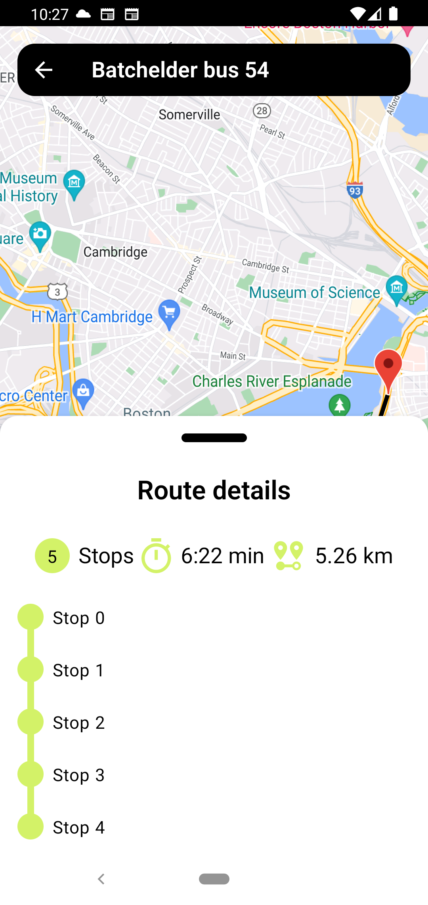

# Routing App Prototype

This is a prototype of a routing app for Android, designed to allow users to pick and preview
routes.
The app contains two screens:

- Routes List Screen
- Route Details Screen

The Routes List Screen displays a list of routes obtained from a fake API, while the Route Details
Screen displays route details, a map, and the most optimal route path.

## Features

- [x] Display a list of routes from a fake API.
- [x] View route details, including a map with the optimal route path.
- [x] Displaying route on map
- [x] Utilize a routing API for route path calculation (Geoapify)
- [] Display address for each stop with Reverse Geocoding API(Geoapify)

## Getting Started

Follow these instructions to get a copy of the project up and running on your local machine for
development and testing purposes.

### Prerequisites

- Android Studio (or your preferred Android development environment)
- Git

### Installation

1. Clone the repository to your local machine using Git:

   ```bash
   git clone git@github.com:mastahnish/routing-app.git
   ```

2. Open the project in Android Studio.

3. Edit `local.properties` file and add necessary API keys:

   ```properties
   sdk.dir=/Users/jacekrys/Library/Android/sdk
   
   # New lines
   MAPS_API_KEY=<your_maps_api_key>
   ROUTING_API_KEY=<your_geoapify_api_key>
   ``` 

3. Build and run the app on your Android emulator or physical device.

## Project Structure
**Model-View-ViewModel with Clean Architecture**.

The project is organized as follows:

- `core` - contains code shared between features
- `feature` - contains packages divided by feature

Single feature package is divided into 3 Clean Architecture layers:

- `data` - contains data sources and repositories
- `domain` - contains business logic
- `presentation` - contains UI logic

## Usage

1. Upon launching the app, you will land on the Routes List Screen.
2. Click on a route item in the list to view its details on the Route Details Screen.
3. The Route Details Screen will display route information, a map, and the optimal route path.

## Acknowledgments

- Fake routes API provided by [BusRight](https://busright-interview.deno.dev/).
- Mapping library: Google Maps
- Routing API: [Geoapify](https://www.geoapify.com/)



